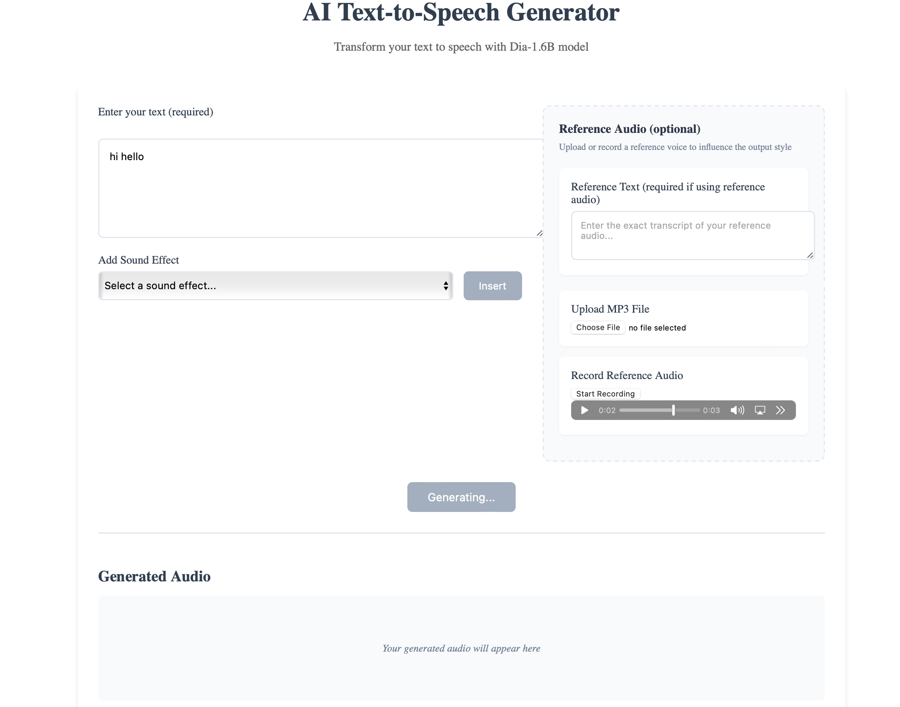

# Text-to-Speech Application with Dia-1.6B

ADD SOME GENERAL INFO ABOUT TEXT TO VOICE MODELS AND ADD A DEMO!


A full-stack text-to-speech application using the Dia-1.6B model, FastAPI backend, and Svelte frontend. This tutorial will guide you through setting up, developing, and deploying the application.



## Project Structure

The project consists of two main directories:
- `backend/`: Contains the FastAPI server and Dia model implementation
- `frontend/`: Contains the Svelte frontend application

## Deploy on Koyeb and play around

### Requirements 
To be able to run the app you'll need a Koyeb account 
- A Koyeb account to deploy the application
- The Koyeb CLI installed to interact with Koyeb from the command line
### Backend
[](https://app.koyeb.com/deploy?name=text-to-voice-backend&repository=minettekaum%2Ftext_to_voice&branch=main&workdir=backend&builder=dockerfile&instance_type=gpu-nvidia-a100&regions=na&hc_grace_period%5B8000%5D=300&hc_restart_limit%5B8000%5D=1&hc_timeout%5B8000%5D=300)

Remember to start the backend before the frontend. 
### Frontend 
[](https://app.koyeb.com/deploy?name=text-to-voice-frontend&repository=minettekaum%2Ftext_to_voice&branch=main&workdir=frontend&builder=dockerfile&regions=par&ports=4173%3Bhttp%3B%2F&hc_protocol%5B4173%5D=tcp&hc_grace_period%5B4173%5D=5&hc_interval%5B4173%5D=30&hc_restart_limit%5B4173%5D=3&hc_timeout%5B4173%5D=5&hc_path%5B4173%5D=%2F&hc_method%5B4173%5D=get)

## Work on the project locally

### Step 1: Backend Setup

1. **Clone the repository and set up the backend:**
   ```bash
   git clone <repository-url>
   cd text_to_voice/backend
   uv sync
   ```

2. **Test the backend:**
   ```bash
   uv run fastapi dev main.py
   ```

In the bavkend there is a  `dia` folder form https://github.com/nari-labs/dia.git, it contains the model configuration. The reason for not using `uv add git+https://github.com/nari-labs/dia.git` is that it loads the whole project, which has features that are not necessary for this project.  

The [`main.py`](backend/main.py) contains the FastAPI as a backend wrapper, the model is loaded and initiallised, and the connection between frontend and backend is handled as well in the script. 

### Step 2: Frontend Setup

1. Navigate to the frontend directory:
   ```bash
   cd frontend
   ```

2. Install dependencies:
   ```bash
   pnpm install
   ```

3. Start the development server:
   ```bash
   pnpm run dev
   ```
 
The forntend is done with sveltekit and it has three parts: 

1. **Main Page (`src/routes/+page.svelte`):**
   - Entry point of the application
   - Handles routing to the home page

2. **Home Page (`src/routes/home.svelte`):**
   - Contains the text-to-speech interface
   - Manages audio recording and playback
   - Handles API communication with the backend

3. **Message Component (`src/components/Message.svelte`):**
   - Displays status messages and errors
   - Provides user feedback during text-to-speech processing


### Deployment on Koyeb

Deploy the app to Koyeb using the control panel or via the [Koyeb CLI](https://www.koyeb.com/tutorials/deploy-flux-models-with-pruna-ai-for-8x-faster-inference-on-koyeb#deploy-the-optimized-model-on-koyeb). You can check the configuration for deploying using the controlpanel on the buttons above. 

#### Koyeb CLI Backend 
```bash 
koyeb deploy . text_to_voice/backend \
   --instance-type gpu-nvidia-l40s \
   --region na \
   --type web \
   --port 8000:http \
   --archive-builder \
```
#### Koyeb CLI Frontend 
```bash
koyeb deploy . text_to_voice/frontend \
   --instance-type nano \
   --region na \
   --type web \
   --port 8000:http \
   --archive-builder \
```


## Troubleshooting

Common issues and solutions:

1. **Backend Issues:**
   - Check model loading errors
   - Verify environment variables
   - Check audio file permissions

2. **Frontend Issues:**
   - Verify API endpoint configuration
   - Check CORS settings
   - Ensure proper environment variables

3. **Deployment Issues:**
   - Verify Docker image builds
   - Check Koyeb logs
   - Ensure proper networking configuration


