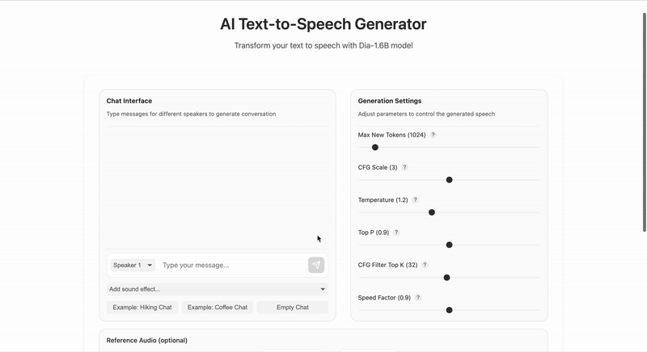

# Text-to-Speech Application with Dia-1.6B

Dia-1.6B is a text-to-speech model by Nari Labs, known for its natural voice modulation and expressive intonation. This tutorial will guide you through building a full-stack TTS application using Dia-1.6B with a FastAPI backend, a Svelte frontend, and deployment on Koyeb.


## Steps 
- [Demo](#demo)
- [Project structure](#project-structure)
- [Deployment](#deploy-on-koyeb)
- [Local Setup](#local-setup)
- [Troubleshooting](#troubleshooting)
- [Summary](#summary)

## Demo

Experience the app in action:



### Example Prompt:
#### Example 1:
* **Speaker 1:** I could really use a French coffee right now.
* **Speaker 2:** Oh! I found this charming French café around the corner. So authentic!
* **Speaker 1:** Really? Do they have fresh pastries?
* **Speaker 2:** Yes! Their chocolate croissants are amazing! And the owner is from Paris. *(humming)*

#### Example 2: 
* **Speaker 1:** Hey, how was your weekend?
* **Speaker 2:** Amazing! Went hiking in the mountains. The view was breathtaking!
* **Speaker 1:** That sounds incredible! I need to get out more.
* **Speaker 2:** You should join me next time! The trail I found is perfect for beginners (laughs)

### Generation Parameters:
#### Example 1: 

Default settings were used, except for `Max New Tokens`, which was set to 2020, and no reference audio was provided.

[Click here to listen to the generated audio](assets/demo_audio_french_coffee.wav)

<audio controls>
  <source src="assets/demo_audio_french_coffee.wav" type="audio/wav">
  Your browser does not support the audio element.
</audio>

##### Example 2:
The default settings were used, and no reference audio was provided.

[Click here to listen to the generated audio](assets/demo_audio_hike.wav)

<audio controls>
  <source src="assets/demo_audio_hike.wav" type="audio/wav">
  Your browser does not support the audio element.
</audio>


---

## Project Structure

The project consists of two main directories:

* **`backend/`:** Contains the FastAPI server and Dia model implementation.
* **`frontend/`:** Contains the Svelte frontend application.

---

## Deploy on Koyeb

### Requirements

Before deploying the app, ensure you have:

* A [Koyeb](https://www.koyeb.com) account.
* The [Koyeb CLI](https://www.koyeb.com/docs/cli) installed for command-line interaction.

### Backend Deployment

[](https://app.koyeb.com/deploy?name=text-to-voice-backend&repository=minettekaum%2Ftext_to_voice&branch=main&workdir=backend&builder=dockerfile&instance_type=gpu-nvidia-a100&regions=na&hc_grace_period%5B8000%5D=300&hc_restart_limit%5B8000%5D=1&hc_timeout%5B8000%5D=300)

### Frontend Deployment

[](https://app.koyeb.com/deploy?name=text-to-voice-frontend&repository=minettekaum%2Ftext_to_voice&branch=main&workdir=frontend&builder=dockerfile&regions=par&ports=4173%3Bhttp%3B%2F&hc_protocol%5B4173%5D=tcp&hc_grace_period%5B4173%5D=5&hc_interval%5B4173%5D=30&hc_restart_limit%5B4173%5D=3&hc_timeout%5B4173%5D=5&hc_path%5B4173%5D=%2F&hc_method%5B4173%5D=get)

---

## Local Setup

### Prerequisites

- Python 3.6 - 3.10
- Node.js 16+
- pnpm
- uv (Python package installer)

### Step 1: Backend Setup

1. **Clone the repository and navigate to the backend directory:**

   ```bash
   git clone https://github.com/minettekaum/text_to_voice.git
   cd text_to_voice/backend
   uv sync
   ```

2. **Run the backend server locally:**

   ```bash
   uv run fastapi dev main.py
   ```

The `backend/` directory includes a `dia` folder with the Dia model from [Nari Labs](https://github.com/nari-labs/dia.git). This approach avoids loading unnecessary components.

Let's take a closer look at the [`main.py`](backend/main.py) file:


### 1. Setup and Initialisation
```python
import logging
from contextlib import asynccontextmanager
from fastapi import FastAPI, HTTPException
from fastapi.middleware.cors import CORSMiddleware
from fastapi.responses import FileResponse
from pydantic import BaseModel
import time
from typing import Optional, List
from pathlib import Path
import soundfile as sf
import numpy as np
import torch
from dia.model import Dia
from utils import process_audio_prompt

logging.basicConfig(
    level=logging.INFO,
    format="%(asctime)s - %(name)s - %(levelname)s - %(message)s",
    handlers=[logging.StreamHandler()],
)
logger = logging.getLogger(__name__)

AUDIO_DIR = Path("audio_files")
AUDIO_DIR.mkdir(exist_ok=True)
UPLOADS_DIR = Path("upload_files")
UPLOADS_DIR.mkdir(exist_ok=True)
DEVICE = "cuda" if torch.cuda.is_available() else "cpu"
logger.info(f"Using DEVICE: {DEVICE}")
```

**Explanation:**
- **Imports**: All necessary libraries for API, audio, and model operations.
- **Logging**: Structured logging for debugging and monitoring.
- **Directory Setup**: Ensures directories for audio and uploads exist.
- **Device Detection**: Chooses GPU (CUDA) if available, otherwise CPU, and logs the choice.

### 2. Audio Prompt Processing Utility
```python
from utils import process_audio_prompt
```

**Explanation:**
- The `process_audio_prompt` function is imported from [`utils.py`](backend/utils.py).
- This function is used to process the audio prompt input for voice cloning in the main generation endpoint.

### 3. ModelManager Class
```python
class ModelManager:
    """Manages the loading, unloading and access to the Dia model."""

    def __init__(self):
        self.device = DEVICE
        self.dtype_map = {
            "cpu": "float32",
            "cuda": "float16",  
        }

    def load_model(self):
        """Load the Dia model with appropriate configuration."""
        try:
            dtype = self.dtype_map.get(self.device, "float16")
            logger.info(f"Loading model with {dtype} on {self.device}")
            self.model = Dia.from_pretrained("nari-labs/Dia-1.6B", compute_dtype=dtype, device=self.device)
        except Exception as e:
            logger.error(f"Error loading model: {e}")
            raise

    def unload_model(self):
        """Cleanup method to properly unload the model."""
        try:
            del self.model
            if torch.cuda.is_available():
                torch.cuda.empty_cache()
        except Exception as e:
            logger.error(f"Error unloading model: {e}")

    def get_model(self):
        """Get the current model instance."""
        if self.model is None:
            raise RuntimeError("Model not loaded. Call load_model() first.")
        return self.model


model_manager = ModelManager()
```

**Explanation:** This class manages the Dia model lifecycle:
- **`__init__`**: Sets up device and data type mapping (float32 for CPU, float16 for GPU to save memory)
- **`load_model`**: Loads the 1.6B parameter Dia model from Hugging Face
- **`unload_model`**: Properly cleans up model memory, especially important for GPU memory
- **`get_model`**: Provides access to the loaded model with error checking

### 4. API Setup and Configuration
```python
class AudioPrompt(BaseModel):
    sample_rate: int
    audio_data: List[float]  

class GenerateRequest(BaseModel):
    text_input: str
    audio_prompt_input: Optional[AudioPrompt] = None
    max_new_tokens: int = 1024
    cfg_scale: float = 3.0
    temperature: float = 1.3
    top_p: float = 0.95
    cfg_filter_top_k: int = 35
    speed_factor: float = 0.94

@asynccontextmanager
async def lifespan(_: FastAPI):
    """Handle model lifecycle during application startup and shutdown."""
    logger.info("Starting up application...")
    model_manager.load_model()
    yield
    logger.info("Shutting down application...")
    model_manager.unload_model()
    logger.info("Application shut down successfully")

app = FastAPI(
    title="Dia Text-to-Voice API",
    description="API for generating voice using Dia model",
    version="1.0.0",
    lifespan=lifespan,
)

app.add_middleware(
    CORSMiddleware,
    allow_origins=[
        "https://soft-lexine-challenge-d3e578f4.koyeb.app",
        "https://gothic-sara-ann-challenge-8bad5bca.koyeb.app",
        "http://localhost:5173"
    ],
    allow_credentials=True,
    allow_methods=["*"],
    allow_headers=["*"],
)

@app.get("/api/health")
async def health_check():
    return {"status": "ok", "message": "Backend is running"}
```

**Explanation:** This section covers the complete API setup:
- **Data Models**: Pydantic models for request validation (`AudioPrompt` and `GenerateRequest`)
- **Application Lifecycle**: Manages model loading/unloading during server startup/shutdown
- **FastAPI App**: Creates the application with metadata and CORS middleware for frontend integration
- **Health Check**: Simple endpoint to verify the backend is running

### 5. Main Generation Endpoint and Input Validation 
```python
@app.post("/api/generate")
async def run_inference(request: GenerateRequest):
    """
    Runs Nari inference using the model from model_manager and provided inputs.
    Uses temporary files for text and audio prompt compatibility with inference.generate.
    """
    if not request.text_input or request.text_input.isspace():
        raise HTTPException(status_code=400, detail="Text input cannot be empty.")

    temp_txt_file_path = None
    temp_audio_prompt_path = None
    output_filepath = AUDIO_DIR / f"{int(time.time())}.wav"

    try:
        prompt_path_for_generate = None
        if request.audio_prompt_input is not None:
            prompt_path_for_generate = process_audio_prompt(request.audio_prompt_input)

        model = model_manager.get_model()

        start_time = time.time()

        with torch.inference_mode():
            logger.info(f"Starting generation with audio prompt: {prompt_path_for_generate}")
            output_audio_np = model.generate(
                request.text_input,
                max_tokens=request.max_new_tokens,
                cfg_scale=request.cfg_scale,
                temperature=request.temperature,
                top_p=request.top_p,
                cfg_filter_top_k=request.cfg_filter_top_k,
                use_torch_compile=False,
                audio_prompt=prompt_path_for_generate,
            )
            logger.info(f"Generation completed. Output shape: {output_audio_np.shape if output_audio_np is not None else None}")

        end_time = time.time()
        logger.info(f"Generation finished in {end_time - start_time:.2f} seconds.")

        if output_audio_np is None:
            raise HTTPException(status_code=500, detail="Model generated no output")

        output_sr = 44100

        original_len = len(output_audio_np)
        speed_factor = max(0.1, min(request.speed_factor, 5.0))
        target_len = int(original_len / speed_factor)
        
        if target_len != original_len and target_len > 0:
            x_original = np.arange(original_len)
            x_resampled = np.linspace(0, original_len - 1, target_len)
            output_audio_np = np.interp(x_resampled, x_original, output_audio_np)
            logger.debug(f"Resampled audio from {original_len} to {target_len} samples")

        output_audio_np = np.clip(output_audio_np, -1.0, 1.0)
        output_audio_np = (output_audio_np * 32767).astype(np.int16)

        sf.write(str(output_filepath), output_audio_np, output_sr)
        logger.info(f"Audio saved to {output_filepath}")

        return FileResponse(
            path=str(output_filepath),
            media_type="audio/wav",
            filename=output_filepath.name
        )

    except Exception as e:
        logger.error(f"Error during inference: {e}")
        if isinstance(e, HTTPException):
            raise e
        raise HTTPException(status_code=500, detail=str(e))

    finally:
        if temp_txt_file_path and Path(temp_txt_file_path).exists():
            try:
                Path(temp_txt_file_path).unlink()
                logger.debug(f"Deleted temporary text file: {temp_txt_file_path}")
            except OSError as e:
                logger.warning(f"Error deleting temporary text file {temp_txt_file_path}: {e}")
        if temp_audio_prompt_path and Path(temp_audio_prompt_path).exists():
            try:
                Path(temp_audio_prompt_path).unlink()
                logger.debug(f"Deleted temporary audio prompt file: {temp_audio_prompt_path}")
            except OSError as e:
                logger.warning(f"Error deleting temporary audio prompt file {temp_audio_prompt_path}: {e}")
```

**Explanation:** This is the core endpoint that handles text-to-speech generation. It includes:
- **Input Validation**: Ensures the text is not empty
- **File Setup**: Creates paths for temporary and output files
- **Audio Prompt Processing**: Handles voice cloning if provided (using `process_audio_prompt` from `utils.py`)
- **Model Generation**: Calls the Dia model with all parameters
- **Audio Processing**: Applies speed factor and converts to WAV format
- **File Output**: Saves and returns the audio file
- **Error Handling**: Comprehensive error handling with proper cleanup

### Summary

This FastAPI application provides a complete text-to-speech service using the Dia model. It handles:
- Model lifecycle management
- Voice cloning with audio prompts
- Audio processing and speed control
- File management and cleanup
- Error handling and logging
- CORS for frontend integration
You can optimise the model for faster inference using Pruna AI. Follow this [tutorial](https://www.koyeb.com/tutorials/deploy-flux-models-with-pruna-ai-for-8x-faster-inference-on-koyeb) for guidance.

---

### Step 2: Frontend Setup

1. **Navigate to the frontend directory:**

   ```bash
   cd frontend
   ```

2. **Install dependencies:**

   ```bash
   pnpm install
   ```

3. **Start the development server:**

   ```bash
   pnpm run dev
   ```

The frontend uses SvelteKit with a modular component architecture:

#### Core Components:

* **[`ChatInterface.svelte`](frontend/src/components/ChatInterface.svelte):** Manages message display, input handling, and speaker selection.
* **[`GenerationSettings.svelte`](frontend/src/components/GenerationSettingd.svelte):** Provides controls for AI model parameters with tooltips.
* **[`SoundEffectsPanel.svelte`](frontend/src/components/SoundEffectsPanel.svelte):** Allows sound effect selection and includes example dialogues.
* **[`AudioControls.svelte`](frontend/src/components/AudioControls.svelte):** Handles audio recording, file uploads, and playback.
* **[`GenerationButton.svelte`](frontend/src/components/GenerationSettings.svelte):** Facilitates TTS generation and communicates with the backend. Remember to change the URL on line 123 if your deploying it your self.
* **[`AudioOutput.svelte`](frontend/src/components/AudioOutput.svelte):** Displays playback and download options for generated audio.
* **[`home.svelte`](frontend/src/routes/Home.svelte):** Main landing page component that orchestrates the text-to-voice interface.

---

### Deployment on Koyeb

Deploy the app using the Koyeb control panel or the [CLI](https://www.koyeb.com/docs/build-and-deploy/cli/installation).

### CLI Deployment Commands

#### Backend:

```bash
koyeb deploy . text_to_voice/backend \
   --instance-type gpu-nvidia-A100 \
   --region na \
   --type web \
   --port 8000:http \
   --archive-builder
```

#### Frontend:

```bash
koyeb deploy . text_to_voice/frontend \
   --instance-type nano \
   --region na \
   --type web \
   --port 4173:http \
   --archive-builder
```

---

## Troubleshooting

### Backend Issues:

* Ensure the Dia model loads correctly and verify environment variables.
* Check permissions for audio file handling.

### Frontend Issues:

* Verify API endpoint configurations and CORS settings.

### Deployment Issues:

* Inspect Docker image build logs for errors.
* Review Koyeb logs for networking and configuration issues.

For further assistance, go to the [Koyeb Documentation](https://www.koyeb.com/docs).

## Summary
This tutorial has guided you through setting up the backend with FastAPI, creating an interactive frontend with SvelteKit, and deploying the application on Koyeb. You can now explore further customisation, optimise the model for better performance, or expand the app's features.

For further assistance, go to the [Koyeb Documentation](https://www.koyeb.com/docs) and [Nari Labs](https://huggingface.co/nari-labs/Dia-1.6B).