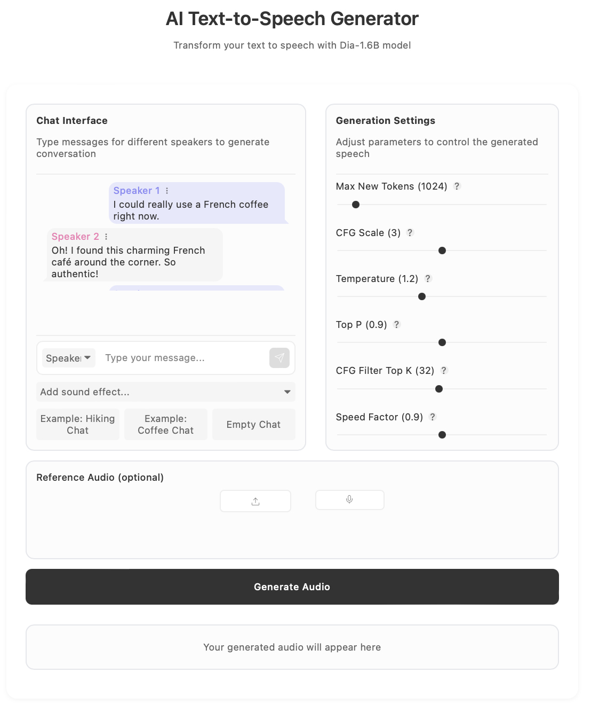

# Text-to-Speech Application with Dia-1.6B

ADD SOME GENERAL INFO ABOUT TEXT TO VOICE MODELS AND ADD A DEMO!


A full-stack text-to-speech application using the Dia-1.6B model, FastAPI backend, and Svelte frontend. This tutorial will guide you through setting up, developing, and deploying the application.



## Project Structure

The project consists of two main directories:
- `backend/`: Contains the FastAPI server and Dia model implementation
- `frontend/`: Contains the Svelte frontend application

## Deploy on Koyeb and play around

### Requirements 
To be able to run the app you'll need a Koyeb account 
- A Koyeb account to deploy the application
- The Koyeb CLI installed to interact with Koyeb from the command line
### Backend
[](https://app.koyeb.com/deploy?name=text-to-voice-backend&repository=minettekaum%2Ftext_to_voice&branch=main&workdir=backend&builder=dockerfile&instance_type=gpu-nvidia-a100&regions=na&hc_grace_period%5B8000%5D=300&hc_restart_limit%5B8000%5D=1&hc_timeout%5B8000%5D=300)

Remember to start the backend before the frontend. 
### Frontend 
[](https://app.koyeb.com/deploy?name=text-to-voice-frontend&repository=minettekaum%2Ftext_to_voice&branch=main&workdir=frontend&builder=dockerfile&regions=par&ports=4173%3Bhttp%3B%2F&hc_protocol%5B4173%5D=tcp&hc_grace_period%5B4173%5D=5&hc_interval%5B4173%5D=30&hc_restart_limit%5B4173%5D=3&hc_timeout%5B4173%5D=5&hc_path%5B4173%5D=%2F&hc_method%5B4173%5D=get)

## Work on the project locally

### Step 1: Backend Setup ÄNDRA TILL HUR DU KAN DEPLOYA DEN PÅ KOYEB OCH LEKA

1. **Clone the repository and set up the backend:**
   ```bash
   git clone <repository-url>
   cd text_to_voice/backend
   uv sync
   ```

2. **Test the backend:**
   ```bash
   uv run fastapi dev main.py
   ```

In the bavkend there is a  `dia` folder form https://github.com/nari-labs/dia.git, it contains the model configuration. The reason for not using `uv add git+https://github.com/nari-labs/dia.git` is that it loads the whole project, which has features that are not necessary for this project.  

The [`main.py`](backend/main.py) contains the FastAPI as a backend wrapper, the model is loaded and initiallised, and the connection between frontend and backend is handled as well in the script. 

### Step 2: Frontend Setup

1. Navigate to the frontend directory:
   ```bash
   cd frontend
   ```

2. Install dependencies:
   ```bash
   pnpm install
   ```

3. Start the development server:
   ```bash
   pnpm run dev
   ```
 

#### Key Components
The forntend is done with sveltekit and it has three parts: 

1. **Main Page (`src/routes/+page.svelte`):**
   - Entry point of the application
   - Handles routing to the home page

2. **Home Page (`src/routes/home.svelte`):**
   - Contains the text-to-speech interface
   - Manages audio recording and playback
   - Handles API communication with the backend

3. **Message Component (`src/components/Message.svelte`):**
   - Displays status messages and errors
   - Provides user feedback during text-to-speech processing


#### Key Components Implementation

1. **Main Application State (`src/routes/home.svelte`):**
   ```typescript
   <script lang="ts">
       import Message from '../components/Message.svelte';
       
       interface Message {
           speaker: string;
           text: string;
       }
   
       // State management
       let messages: Message[] = [];
       let currentInput = '';
       let availableSpeakers: string[] = ['[S1]'];
       let selectedSpeaker = '[S1]';
       let audioUrl: string | null = null;
       let isProcessing = false;
       
       // Generation parameters
       let maxNewTokens = 1024;  
       let cfgScale = 3.0;      
       let temperature = 1.2;   
       let topP = 0.9;          
       let cfgFilterTopK = 32;   
       let speedFactor = 0.9;    
   </script>
   ```

2. **Text Generation Function:**
   ```typescript
   async function handleGenerate() {
       if (messages.length === 0) return;
       
       isProcessing = true;
       error = null;
       
       try {
           // Combine all messages into a single text
           const combinedText = messages
               .map(msg => `${msg.speaker}: ${msg.text}`)
               .join('\n');
           
           // Prepare request data
           const requestData = {
               text_input: combinedText,
               max_new_tokens: maxNewTokens,
               cfg_scale: cfgScale,
               temperature: temperature,
               top_p: topP,
               cfg_filter_top_k: cfgFilterTopK,
               speed_factor: speedFactor
           };
           
           // API call implementation
           // ... rest of the generation logic
       } catch (err) {
           error = err.message;
       } finally {
           isProcessing = false;
       }
   }
   ```

3. **Message Component (`src/components/Message.svelte`):**
   ```typescript
   <script lang="ts">
       import { createEventDispatcher } from 'svelte';
       
       export let message: { speaker: string; text: string };
       export let i: number;
       export let editingMessageIndex: number | null;
       export let editText: string;
   
       const dispatch = createEventDispatcher();
   
       function formatSpeakerName(speaker: string) {
           return speaker
               .replace('[S1]', 'Speaker 1')
               .replace('[S2]', 'Speaker 2');
       }
   </script>
   
   <div class="message" data-speaker={message.speaker}>
       <div class="message-text">
           <div class="message-header">
               <div class="bubble-speaker">
                   {formatSpeakerName(message.speaker)}
               </div>
               <!-- Message controls -->
           </div>
           {#if editingMessageIndex === i}
               <input 
                   bind:value={editText}
                   class="edit-input"
                   on:keydown={handleKeyDown}
               />
           {:else}
               <div class="bubble-content">{message.text}</div>
           {/if}
       </div>
   </div>
   ```

4. **API Integration Service:**
   ```typescript
   // src/lib/api.ts
   const API_URL = import.meta.env.VITE_API_URL || 'http://localhost:8000';
   
   export async function generateSpeech(text: string, audioPrompt?: AudioPrompt) {
       const response = await fetch(`${API_URL}/api/generate`, {
           method: 'POST',
           headers: {
               'Content-Type': 'application/json',
           },
           body: JSON.stringify({
               text_input: text,
               audio_prompt_input: audioPrompt,
               max_new_tokens: 1024,
               cfg_scale: 3.0,
               temperature: 1.3,
               top_p: 0.95,
               cfg_filter_top_k: 35,
               speed_factor: 0.94
           })
       });
   
       if (!response.ok) {
           throw new Error('Failed to generate speech');
       }
   
       return response;
   }
   ```

5. **Audio Processing Utilities:**
   ```typescript
   async function processAudioInput(audioUrl: string) {
       const audioContext = new AudioContext();
       const response = await fetch(audioUrl);
       const blob = await response.blob();
       const arrayBuffer = await blob.arrayBuffer();
       const audioBuffer = await audioContext.decodeAudioData(arrayBuffer);
       
       // Get channel data and normalize
       const channelData = audioBuffer.getChannelData(0);
       const normalizedData = Array.from(channelData).map(x => 
           Math.max(-1, Math.min(1, x))
       );
       
       return {
           sample_rate: audioBuffer.sampleRate,
           audio_data: normalizedData
       };
   }
   ```


#### API Integration

Create an API service to communicate with the backend:

1. **Configure API endpoints:**
   ```typescript
   const API_URL = import.meta.env.VITE_API_URL || 'http://localhost:8000';

   export const generateSpeech = async (text: string, audioPrompt?: AudioPrompt) => {
     const response = await fetch(`${API_URL}/api/generate`, {
       method: 'POST',
       headers: {
         'Content-Type': 'application/json',
       },
       body: JSON.stringify({
         text_input: text,
         audio_prompt_input: audioPrompt,
         // Additional parameters with default values
         max_new_tokens: 1024,
         cfg_scale: 3.0,
         temperature: 1.3,
         top_p: 0.95,
         cfg_filter_top_k: 35,
         speed_factor: 0.94
       })
     });

     if (!response.ok) {
       throw new Error('Failed to generate speech');
     }

     return response;
   };
   ```

#### Environment Configuration

1. **Create a `.env` file:**
   ```
   VITE_API_URL=http://localhost:8000
   ```

2. **For production, update the environment variables in your deployment platform.**

#### Running the Frontend

1. **Development mode:**
   ```bash
   pnpm run dev
   ```

2. **Build for production:**
   ```bash
   pnpm run build
   ```

3. **Preview production build:**
   ```bash
   pnpm run preview
   ```

#### Styling and UI/UX

The application uses a modern, responsive design with these key features:

1. **Responsive Layout:**
   - Adapts to different screen sizes
   - Mobile-friendly interface

2. **User Feedback:**
   - Loading indicators during processing
   - Clear error messages
   - Success notifications

3. **Audio Controls:**
   - Record button for voice input
   - Playback controls for generated audio
   - Volume control

4. **Text Input:**
   - Large text area for input
   - Character count
   - Clear button

#### Testing

1. **Unit Tests:**
   ```bash
   pnpm run test:unit
   ```

2. **Integration Tests:**
   ```bash
   pnpm run test:integration
   ```

3. **End-to-End Tests:**
   ```bash
   pnpm run test:e2e
   ```

#### Best Practices

1. **Performance:**
   - Lazy loading of components
   - Efficient state management
   - Optimized asset loading

2. **Accessibility:**
   - ARIA labels
   - Keyboard navigation
   - Screen reader support

3. **Error Handling:**
   - Graceful error recovery
   - User-friendly error messages
   - Fallback content

4. **Security:**
   - Input sanitization
   - CORS configuration
   - Environment variable management

## Step 4: Deployment on Koyeb

1. **Prepare for deployment:**
   - Ensure all environment variables are set
   - Test the application locally
   - Build Docker images for both frontend and backend

2. **Deploy Backend:**
   ```bash
   # Build the backend Docker image
   docker build -t text-to-speech-backend ./backend
   
   # Push to a container registry (e.g., Docker Hub)
   docker tag text-to-speech-backend yourusername/text-to-speech-backend
   docker push yourusername/text-to-speech-backend
   ```

3. **Deploy Frontend:**
   ```bash
   # Build the frontend Docker image
   docker build -t text-to-speech-frontend ./frontend
   
   # Push to container registry
   docker tag text-to-speech-frontend yourusername/text-to-speech-frontend
   docker push yourusername/text-to-speech-frontend
   ```

4. **Deploy on Koyeb:**
   - Create a new app on Koyeb
   - Select "Deploy from Docker image"
   - Configure environment variables
   - Set up the backend service first
   - Deploy the frontend service
   - Configure networking between services

5. **Configure Domain:**
   - Set up custom domains in Koyeb
   - Configure SSL certificates
   - Update DNS settings

## Troubleshooting

Common issues and solutions:

1. **Backend Issues:**
   - Check model loading errors
   - Verify environment variables
   - Check audio file permissions

2. **Frontend Issues:**
   - Verify API endpoint configuration
   - Check CORS settings
   - Ensure proper environment variables

3. **Deployment Issues:**
   - Verify Docker image builds
   - Check Koyeb logs
   - Ensure proper networking configuration


